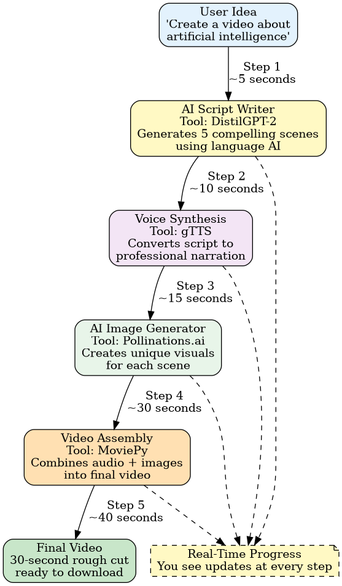
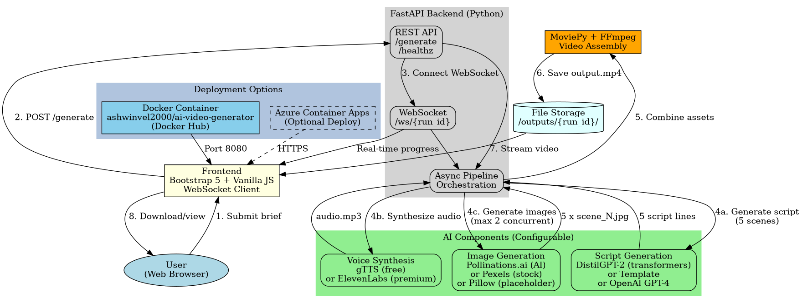

# Script-to-Rough-Cut

> Transform text prompts into AI-generated video rough cuts in 40 seconds

## System Architecture

### High-Level Flow


### Detailed System Architecture  


## Overview

Script-to-Rough-Cut is a production-ready web application that automatically generates 30-second video rough cuts from text descriptions. The pipeline orchestrates multiple AI services:

1. **Script Generation** - DistilGPT-2, template-based, or OpenAI GPT-4
2. **Voice-Over** - gTTS (free) or ElevenLabs (premium)
3. **Visual Assets** - Pollinations.ai (AI images), Pexels (stock photos), or Pillow (placeholders)
4. **Video Assembly** - MoviePy + FFmpeg (1920x1080 @ 24fps)

## Tech Stack

- **Backend**: FastAPI (Python 3.11+)
- **Frontend**: HTML5, Bootstrap 5, Vanilla JavaScript
- **AI Services**: HuggingFace Transformers, gTTS, Pollinations.ai (free) | OpenAI, ElevenLabs, Pexels (optional paid)
- **Video Processing**: MoviePy, FFmpeg
- **Real-time Updates**: WebSocket
- **Deployment**: Docker, Azure Container Apps

## Quick Start

### Local Development

```bash
# Clone repository
git clone https://github.com/ashwinvel2000/genai-roughcut.git
cd genai-roughcut

# Create virtual environment
python -m venv venv
source venv/bin/activate  # On Windows: venv\Scripts\activate

# Install dependencies
pip install -r requirements.txt

# Run server
uvicorn app.main:app --reload --host 0.0.0.0 --port 8080

# Open browser
http://localhost:8080
```

### Docker Deployment

```bash
# Build and run with Docker Compose
docker-compose up --build

# Or use the test script
./test-docker.sh

# Deploy to Azure Container Apps
./deploy.sh
```

## Configuration

Copy `.env.example` to `.env` and configure:

### Free Stack (No API Keys Required)
```env
SCRIPT_MODE=transformers  # or "template"
TTS_MODE=gtts
IMAGE_MODE=pollinations
```

### Enhanced Stack (Optional API Keys)
```env
SCRIPT_MODE=openai
TTS_MODE=elevenlabs
IMAGE_MODE=pexels

OPENAI_API_KEY=your_key_here
ELEVENLABS_API_KEY=your_key_here
ELEVENLABS_VOICE_ID=21m00Tcm4TlvDq8ikWAM
PEXELS_API_KEY=your_key_here
```

## Features

- **Modular AI Components** - Switch between free and premium services via config
- **Real-time Progress** - WebSocket updates for script generation, images, and video assembly
- **Async Pipeline** - Concurrent operations with rate limiting
- **Production Ready** - Docker support, health checks, error handling
- **Flexible Deployment** - Local, Docker, or Azure Container Apps

## Project Structure

```
script-to-roughcut/
├── app/
│   ├── main.py              # FastAPI application
│   ├── pipeline.py          # AI pipeline orchestration
│   ├── settings.py          # Configuration management
│   ├── storage.py           # File handling
│   └── templates/
│       └── index.html       # Web interface
├── assets/                  # Architecture diagrams
├── outputs/                 # Generated videos
├── Dockerfile              # Container definition
├── docker-compose.yml      # Multi-container setup
├── deploy.sh              # Azure deployment script
├── requirements.txt       # Python dependencies
└── README.md
```

## API Endpoints

- `GET /` - Web interface
- `POST /generate` - Generate video from brief
- `GET /ws` - WebSocket for real-time updates
- `GET /healthz` - Health check endpoint
- `GET /outputs/{run_id}/{filename}` - Serve generated files

## How It Works

1. User submits text brief via web interface
2. Backend generates 5 script lines using configured AI model
3. TTS synthesizes narration from script
4. Image generator creates 5 scene visuals from script prompts
5. MoviePy assembles video with audio, images, and captions
6. WebSocket streams real-time progress to frontend
7. User downloads completed MP4 video

## Docker Hub

Published image: `ashwinvel2000/ai-video-generator:latest`

```bash
docker pull ashwinvel2000/ai-video-generator:latest
docker run -p 8080:8080 ashwinvel2000/ai-video-generator:latest
```

## Development

Built with async/await patterns, type hints, and production best practices:
- Async pipeline orchestration
- WebSocket real-time updates
- Pydantic settings management
- Error handling with graceful fallbacks
- Docker multi-stage builds
- Health check monitoring

## License

MIT License - See LICENSE file for details

## Author

Ashwin Vel - [GitHub](https://github.com/ashwinvel2000)
